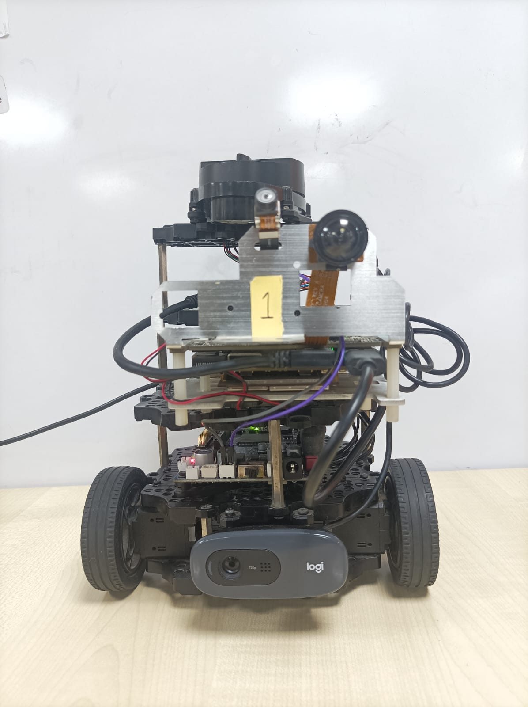
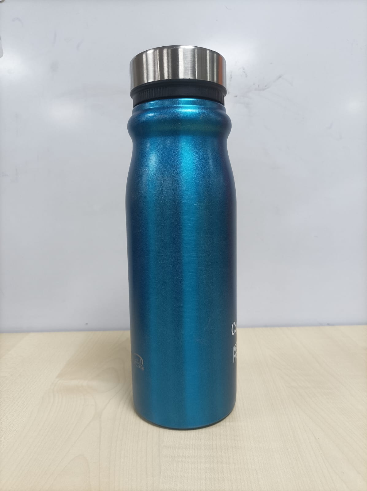
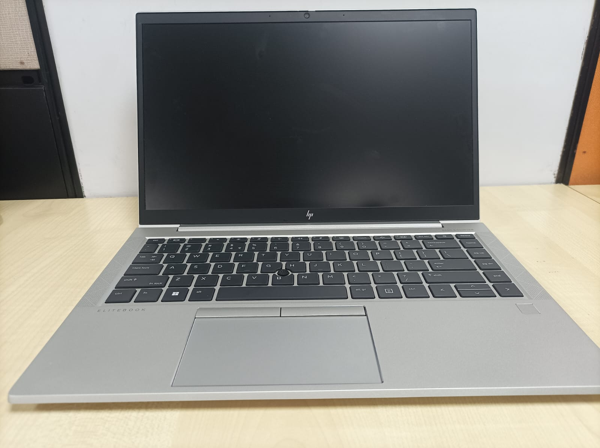
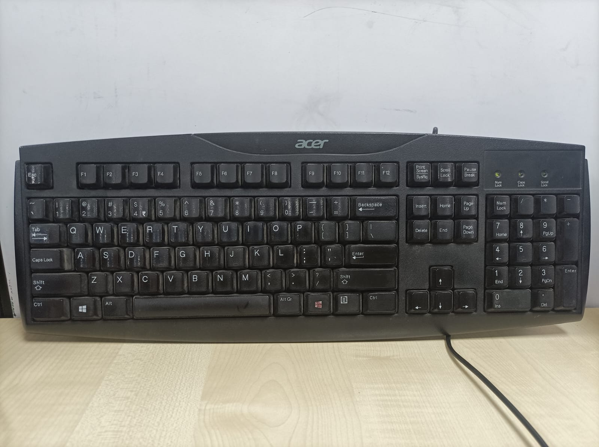

# Real-Time Object Detection and Navigation with TurtleBot3 and Qualcomm RB5
This project demonstrates a comprehensive real-time object detection and navigation system utilizing the TurtleBot3 robot and the Qualcomm RB5 platform. The system integrates multiple advanced technologies to enable the TurtleBot3 to identify, locate, and navigate to objects specified through voice commands. Key features include:

-   **Real-Time Object Detection**: Utilizing the **SSD MobileNet model**, this project performs object detection in real-time. The model runs on the **DSP, GPU, or CPU** of the Qualcomm RB5 to maximize performance and efficiency.

-   **Voice Command Integration**: The system leverages the **Whisper model** for audio transcription, allowing users to specify target objects through voice commands. Transcribed commands are validated against **COCO dataset labels** to ensure accuracy.

-   **Dynamic Navigation**: The TurtleBot3 robot employs either a **spiral or linear search** pattern to locate the specified object. The chosen path planning method can be adjusted based on the scenario or user preference.

-   **Collision Avoidance**: Enhanced obstacle avoidance algorithms are implemented to ensure safe navigation, allowing the robot to maneuver around obstacles while searching for the target object.

-   **ROS Integration**: The entire system is built on **ROS**, facilitating seamless communication between different components, including object detection, voice command processing, and robot navigation.

## Setup guide

### Requirements
- Python 3
- ROS Melodic Installation on RB5 & Host Machine (ubuntu 18) [Installation Guide](http://wiki.ros.org/melodic/Installation/Ubuntu) 
- Install TurtleBot3 Packages on RB5 & Host Machine [Installation Guide](https://emanual.robotis.com/docs/en/platform/turtlebot3/quick-start/#install-turtlebot3-packages) 
- Install python libraries included in requirements.txt on RB5
- ROS cv_bridge with Python3 on RB5 [Installation Guide](https://cyaninfinite.com/ros-cv-bridge-with-python-3/) 
- Node.js & npm on Host Machine [Installation Guide](https://gist.github.com/MichaelCurrin/aa1fc56419a355972b96bce23f3bccba)
-  SNPE Libraries on RB5
    - Setting up the SNPE Libraries on RB5
        1. Copy the SNPE header files & runtime libraries for aarch64-ubuntu-gcc7.5 on RB5 from host system using ADB
            ``` sh
            ubuntu@ubuntu: adb push <SNPE_ROOT>/include/ /data/snpe/include/
            ubuntu@ubuntu: adb push <SNPE_ROOT>/lib/aarch64-ubuntu-gcc7.5/* /data/snpe/
            ubuntu@ubuntu: adb push <SNPE_ROOT>/lib/dsp/* /data/snpe/
            ```
        2. Open the terminal of RB5 and append the lines given below at the end of ~/.bashrc file.
            ```sh
            sh4.4 # export PATH=$PATH:/data/snpe/
            sh4.4 # export LD_LIBRARY_PATH=$LD_LIBRARY_PATH:/data/snpe/
            sh4.4 # export ADSP_LIBRARY_PATH="/data/snpe;/system/lib/efsa/adsp;system/vendor/lb/rfsa/adsp;/dsp"
            ```
        3.	Run the command given below to reinitialize the terminal session 
            ``` sh
            root@ # source ~/.bashrc
            ```
`Note: If device is connected via SSH, please use scp tool for copying the SNPE runtime libraries in /data/snpe folder on RB5.`
    
## Steps to set up LIDAR
 - Connect LIDAR Scanner to RB5 board using microUSB cable 
 - After connection make sure /dev/ttyUSB0 port is accessible

## Setting up the Camera
 - Make sure that USB Camera is connected to RB5
 - Attach the camera in 1st layer of Turtlebot Burger towards front facing.
 - Keep Angle to camera 20-30 Degree Down side.

 | Camera & Lidar Connection View | Objects We Tested On |
 |--------------------------------| ------------------------|
 ||    


### Install ROS Bridge Server on Host Machine
```sh
$ sudo apt install ros-melodic-rosbridge-server
```
`NOTE: Add below line in the end of ~/.bashrc file, to avoid the environment variables exports for all the time while opening terminal. Make sure that you reopen the shell once the file is edited.` 

Add below lines in ~/.bashrc of RB5

```sh
# APPEND AT THE END OF ~/.bashrc
export ROS_MASTER_URI=http://<HOST_MACHINE_IP>:11311
export ROS_HOSTNAME=<RB5_IP>
export TURTLEBOT3_MODEL=burger
source /opt/ros/melodic/setup.bash

``` 
Add below lines in ~/.bashrc of Host Machine

```sh
# APPEND AT THE END OF ~/.bashrc
export ROS_MASTER_URI=http://<HOST_MACHINE_IP>:11311
export ROS_HOSTNAME=<HOST_MACHINE_IP>
export TURTLEBOT3_MODEL=burger
source /opt/ros/melodic/setup.bash
``` 

### Prepare ROS workspace
First, initialize your ROS workspace according to the instructions in the [ROS tutorial](http://wiki.ros.org/ROS/Tutorials/InstallingandConfiguringROSEnvironment). Then, clone the Git repository into your workspace. 

## Workspace in Host Machine
To set up the ROS workspace on the host machine, follow these steps:

Initialize the ROS Workspace:
Create a directory for your ROS workspace, initialize it, and set up the necessary environment variables.
 
```sh
$ mkdir -p ~/OBJ_WS/src 
$ cd ~/OBJ_WS/src 
```
Copy the packages in the assets folder to the ~/OBJ_WS/src directory. While the spiral exploration and TurtleBot3 movement after detecting the desired object can be built on the RB5, it is recommended to perform these steps on the host machine. In this setup, the TurtleBot3 is treated as the client and the host system as the server.

```sh
$ cp -r assets/frontier_exploration_turtlebot assets/move_robot assets/riotu_robot_pose_publisher ~/OBJ_WS/src/
```

Install all the dependencies through rosdep, 
```sh
$  cd ~/OBJ_WS
$ rosdep install --from-paths src --ignore-src --rosdistro melodic -yr 
```
Source ROS 1 and build,

```sh
$ cd ~/OBJ_WS 
$ catkin_make -DPYTHON_EXECUTABLE=/usr/bin/python3 
$ source ~/OBJ_WS/devel/setup.bash 
```

Run the command given below to update the ~/.bashrc 
```sh
$ echo source ~/OBJ_WS/devel/setup.bash >> ~/.bashrc 
```

## Workspace in RB5
To set up the ROS workspace on the RB5, follow these steps:

Initialize the ROS Workspace:
Create a directory for your ROS workspace, initialize it, and set up the necessary environment variables.


```sh
$ mkdir -p ~/OBJ_WS/src 
$ cd ~/OBJ_WS/src 
```
We are utilizing the **SSD MobileNet DLC model** on the DSP of the RB5 for real-time inference on each frame. This model publishes data to respective ROS topics, including Xmin, Ymin, **Xmax, Ymax, xOffset, and area**, which are essential for navigation packages. 

Copy the package in the assets folder to the ~/OBJ_WS/src directory.

```sh
$ cp -r assets/object_detection ~/OBJ_WS/src/
```
Install all the dependencies through rosdep, 
```sh
$  cd ~/OBJ_WS
$ rosdep install --from-paths src --ignore-src --rosdistro melodic -yr 
```
Source ROS 1 and build,

```sh
$ cd ~/OBJ_WS 
$ catkin_make -DPYTHON_EXECUTABLE=/usr/bin/python3 
$ source ~/OBJ_WS/devel/setup.bash 
```
We have created two separate workspaces: one for object_detection and another for whisper_pkg, as they require different Python versions for building.

```sh
$ mkdir -p ~/WHISPER_WS/src 
$ cd ~/WHISPER_WS/src 
```
Additionally, we are using the **Whisper model** for voice commands, which are processed and published to the robot to specify the target object it needs to find.

-  Refer this link to get the whisper-base tflite_model https://github.com/usefulsensors/openai-whisper/blob/main/notebooks/whisper_base_tflite_model.ipynb. Execute the cell and download the whisper-base.tflite model.

- Place the downloaded model(whisper-base.tflite) in assets/whisper_pkg/scripts

```sh
$ cp -r assets/whisper_pkg ~/WHISPER_WS/src/
```
Install all the dependencies through rosdep, 
```sh
$  cd ~/WHISPER_WS
$ rosdep install --from-paths src --ignore-src --rosdistro melodic -yr 
```
Source ROS 1 and build,

```sh
$ cd ~/WHISPER_WS  
$ catkin_make -DPYTHON_EXECUTABLE=/usr/bin/python3.8 
$ source ~/WHISPER_WS/devel/setup.bash 
```
Run the command given below to update the ~/.bashrc 
```sh
$ echo source ~/OBJ_WS/devel/setup.bash >> ~/.bashrc 
$ echo source ~/WHISPER_WS/devel/setup.bash >> ~/.bashrc
```

## Execution instruction
-   On Host System,Source the melodic and run roscore
```sh
$ roscore
```
- On RB5 shell, Source the workspace and launch bring up command 
```sh
sh4.4 roslaunch turtlebot3_bringup turtlebot3_robot.launch 
```
- On host system run navigation  
```sh
$ roslaunch turtlebot3_navigation turtlebot3_navigation.launch map_file:=map.yaml 
```
- On host system run rosbridge for web visualization 
```sh
$  roslaunch rosbridge_server rosbridge_websocket.launch 
```
- On the host system, run the React application. We developed a web application using React for teleoperating and monitoring the robot through the Robot Operating System (ROS). This application also provides a camera view of the detected objects with bounding boxes.

```sh
$   cp -r assets/UI ~/UI && cd UI
$   npm install
$   npm start
```
- On host system for robot visualization on the web
```sh
$ rosrun riotu_robot_pose_publisher riotu_robot_pose_publisher
```
- Start the Object Detection Package on RB5
```sh
$ roslaunch object_detection rb5_obj_detection.launch 
```
- Start the Speech Recognition Package on RB5
```sh
$ roslaunch ros_speech_recognization speech_recognize.launch 
```
-   Start the Exploration Package on Host System. You can specify '0' for linear searching or '1' for spiral pattern searching. This package also includes collision avoidance capabilities.

```sh
$ roslaunch frontier_exploration_turtlebot demo.launch 
```
- on Host System
```sh
$ rosrun move_robot Test.py
```

`Note: The Turltebot3 initially searches for the object specified through voice commands. Once the object is detected, it becomes ready to listen for new commands and starts searching for new objects.`

## Demo 


